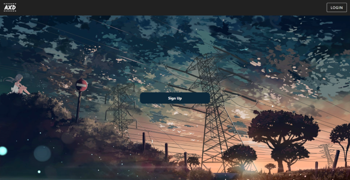
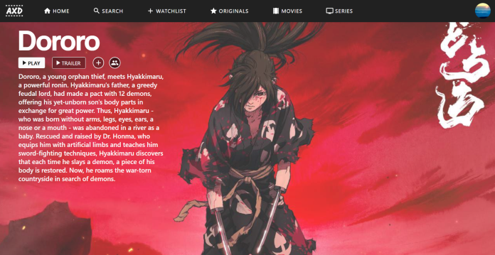

# AnimeXD

## Table of Contents

- [Description](#description)
- [Usage](#usage)
- [License](#license)
- [Questions](#questions)

## Description

This application uses react with firebase to create a simulated video streaming service where users can browse their favorite movies and shows.

## Usage

To utilize this application, run npm start in your terminal or command prompt. Similarly, the deployed application can be run from the following links. Don't want to log in? No worries, just click on the additional links to navigate the pages without logging in.

Deployed application: https://axd.netlify.app/

(Dashboard Page) https://axd.netlify.app/home

(Details Page) https://axd.netlify.app/detail

## License

This project is licensed with MIT.

## Questions

Follow me on [Github](https://github.com/Kayvonk).

To contact me, send an email to kayvonk@gmail.com with your name and inquiry.
