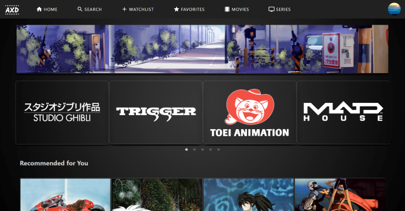
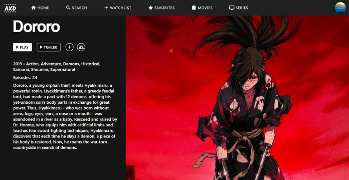

# AnimeXD

## Table of Contents

- [Description](#description)
- [Usage](#usage)
- [License](#license)
- [Questions](#questions)

## Description

This application uses react with redux and firebase (authentication and firestore) to create a simulated video streaming service where users can browse their favorite movies and shows.

## Usage

To utilize this application, run npm start in your terminal or command prompt. Similarly, the deployed application can be run from the following links. Don't want to log in? No worries, just click 'DEMO' on the top right to get to the dashboard without logging in. From there, clicking on a show will take you to its details page. You can navigate back to the dashboard by clicking 'HOME', clicking the logo on the top left, or using the dropdown from the logo.

Deployed application: https://arxd.netlify.app/

(Dashboard Page) https://arxd.netlify.app/home

## License

This project is licensed with MIT.

## Questions

Follow me on [Github](https://github.com/Kayvonk).

To contact me, send an email to kayvonk@gmail.com with your name and inquiry.
